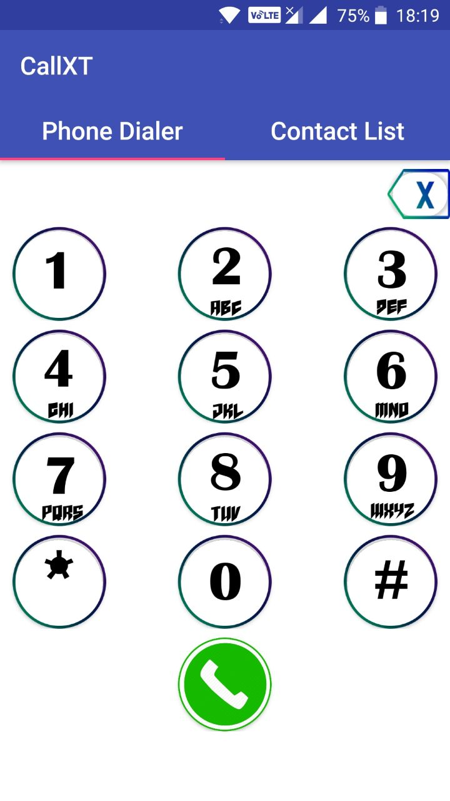
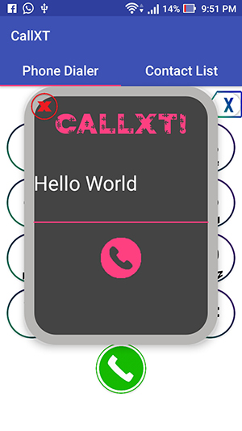
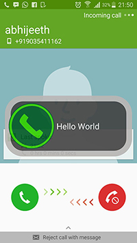
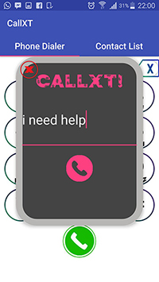
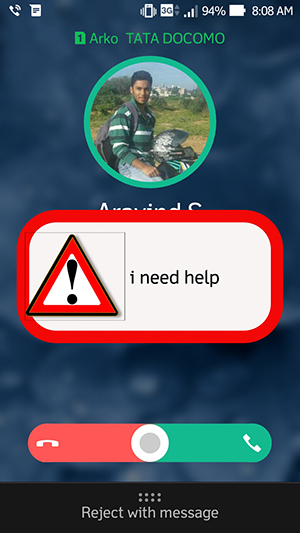

# callXT

callXT is an android app that sends the subject of the call along with the call and is received at the receiver end as a pop up. It integrates the calling and texting features into one activity. This comes in very handy when the other person has to know the subject of the call and during emergency. It changes the pop up according to the type of the text message sent. callXT has a low level text analysis system to find the context of the call and display the pop up accordingly.

# Using the application

## Home screen

The application works similar to the phone's dialer application. On opening the application, you will be able to view a dialer which acts a normal dialer where you can enter a phone number and place a call. 

## Message box

## On the receiving end

## Sending an emphasized message

